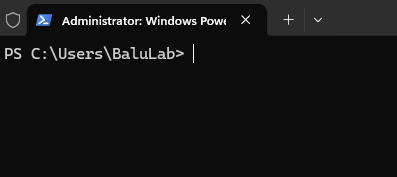

# Install on Windows (Command-Line Inference & MATLAB Inference ONLY)

## 1. Install MATLAB
Visit MATLAB downloads on downloads site. [Link](https://www.mathworks.com/downloads/)

Download & Install R2024b on your Windows machine.

## 2. Install Conda
Visit the [Anaconda website](https://www.anaconda.com/download/success) and download the latest Windows Miniconda installer. [Direct Link](https://repo.anaconda.com/miniconda/Miniconda3-latest-Windows-x86_64.exe).

Once installed using the downloaded `.exe`, open a Powershell instance of command-prompt. It should look something like this:



Type the following command:
```
conda init
```

After hitting enter and allowing the command to run its course, close and re-open the command-prompt. You should now see `(base)` at the beginning of your prompt:


### ⚠️ Handling common problems during conda installation and initialization:
1. `conda` is not recognized
This can arise in many different flavors based on your operating system, but will be some variation of:
```
'conda' is not recognized as internal or external command
```

This is because while the conda installation may have been successful, the installer may not have added conda to your system path. Resolving this is different on different operating systems:
 - Windows: [Adding conda to system environment variables](https://www.geeksforgeeks.org/python/how-to-setup-anaconda-path-to-environment-variable/). If you're curious where the condabin `condabin` can be, usually by default it is at `C:\Users\<username>\miniconda3\condabin`.
 - Linux/MacOS: Usually miniconda installs itself in your path by default. If it didn't, that usually means the install failed. Just in case, you can check [this answer](https://askubuntu.com/questions/849470/how-do-i-activate-a-conda-environment-in-my-bashrc) on Stack Exchange.


## 3. Create CARE Environment
With a conda-initialized shell, navigate to the directory where this repository is installed using `cd` commands. [Detailed Tutorial](https://www.lifewire.com/change-directories-in-command-prompt-5185508).

Once navigated to the repository directory, create an environment for your Python CARE:

```
conda env create -f environment_windows.yml
```

This will install the following dependencies in the CARE environment:
 - **CUDA Version (Python): 12.5**
 - **cuDNN Version (Python): 9.3.0**

### ⚠️ Handling common problems during CARE environment initialization:
1. Pip package cannot be installed.

**SOLUTION:** In `environment_windows.yml`, change the package version of the package that cannot be installed.

```
 - <package_name>==x.x.x
```

could become:

```
 - <package_name>==y.y.y
```

2. `matlabengine` package cannot be installed.

**CASE 1:** Pip error indicates MATLAB cannot be found.
**SOLUTION 1:** Usually this just means you need to install MATLAB R2024b.


**CASE 2:** Pip error indicates MATLAB version does not match the version of the `matlabengine` package.
**SOLUTION 2:** In `environment_windows.yml`, change the version of `matlabengine` listed. By default, it is:
```
 - matlabengine==24.2.2
```

To fix the issue, change the version number on the right of the equal sign to [whatever matlabengine verion is correlated with the installed MATLAB](https://pypi.org/project/matlabengine/#history). For example, if you are running MATLB R2025a, you would want to change the line above to:
```
 - matlabengine==25.1.2
```

***IF YOU CHANGE THE ENVIRONMENT YAML:*** Usually, you will have to remove the previous installation of the CARE package and then reinstall it with the changed `environment_windows.yml`. To do this, you can run:
```
conda env remove --name care --all
```

Then, you can re-run the like to re-create the `care` conda environment with the updated `environment_windows.yml`:
```
conda env create -f environment_windows.yml
```

## 4. Installing TensorRT 10.11.0
1. Dowload ZIP file: [Download Link](https://developer.nvidia.com/downloads/compute/machine-learning/tensorrt/10.11.0/zip/TensorRT-10.11.0.33.Windows.win10.cuda-12.9.zip)
2. Unpack ZIP
3. Copy `TensorRT-10.11.0.33` to `C:\Program Files`
4. Add `TensorRT-10.11.0.33\lib` to system PATH
4. Add `TensorRT-10.11.0.33\bin` to system PATH