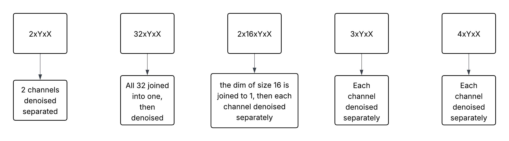

=====
Why FLAME-CARE
=====

Readers may wonder: Why use FLAME-CARE when the `CSBDeep <https://csbdeep.bioimagecomputing.com/>`_ package 
(`GitHub source code <https://github.com/CSBDeep/CSBDeep>`_) already exists to train and use CARE models?

The simple answer is that the FLAME microscope introduces a few unique needs that the CSDBeep package cannot account for.

1. FLAME Microscopy has diverse outputs.
^^^^^^^^^

The image below is a demonstration of all of the possible outputs from a FLAME microscope. This arises from the nature
of timeseries data.

This does not disqualify the default CSBDeep by itself, as different models can be trained to handle each input individually,
or channel dimensions can be removed through matrix reshaping operations.

That being said, the custom ``FLAMEImage`` and ``CAREInferenceSession`` classes implemented by the FLAME-CARE source code
provide unique tooling that utilizes the ``.tileData.txt`` outputted by ScanImage software controlling the FLAME scope
to better handle these diverse outputs.

2. FLAME Microscopy is controlled by MATLAB.
^^^^^^^^^^^^^

MATLAB controls FLAME scopes. This means that ideal CARE implementation will be natively callable by MATLAB. Unfortunately,
the default CSBDeep package requires the use of TensorFlow for inference, which requires Windows Subsystem for Linux
on Windows for GPU acceleration.

FLAME-CARE utilizes TensorRT for inference, allowing MATLAB to directly call GPU-accelerated CARE models for inference.

3. Modern Deep Learning for Microscopy Requires Trial & Error and MLOps.
^^^^^^^^^^^^

The nature of deep learning for image analysis in a scientific setting is that datasets and models change daily. This
means that traditional machine learning deployments that lack MLOps capabilities quickly get overwhelmed by a lack of
version tracking.

FLAME-CARE has custom tooling for dataset management and utilizes both SynologyDrive and MLFlow for MLOps and model
tracking, thereby enabling researchers to track model metrics and have confidence that they are using the best available 
CARE model for their FLAME image denoising.

See `Version Control <./versioning>`_ for more information.