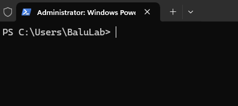

================================
Windows (CLI & MATLAB Inference)
================================

1. Install MATLAB
^^^^^^^^^^^^^^^^^
Visit MATLAB downloads on downloads site. `Link <https://www.mathworks.com/downloads/>`_.

Download & Install any version on your Windows machine.

2. Download Source Code
^^^^^^^^^^^^^^^^^^^^^^^

No matter the method, to install the source code visit `the repository on GitHub <https://github.com/AlexSath/FLAME-CARE>`_.

a. Clone Repository through GitHub CLI (Recommended)
~~~~

Git is a tool to manage different versions of code. GitHub is a website hosted by Microsoft where people upload
their code to the cloud for editing and sharing. GitHub uses Git (the tool) to manage changes to the codebase
of projects it hosts.

To interface with Git, the tool must be downloaded to your computer. We recommend doing this when using FLAME-CARE
because it allows you to use your CLI to update the code from the cloud repository (as opposed
to re-downloading it every time there is an update). To get started, be sure to install some version of the git
CLI. `This tutorial is helpful <https://github.com/git-guides/install-git>`_.

Once it's downloaded, you can verify that it's installed using this command:

::

     git version

Once you've verified the git installation, you can clone the repository with one of these commands:

::

     git clone git@github.com:AlexSath/FLAME-CARE.git

::

     git clone https://github.com/AlexSath/FLAME-CARE.git

::

     gh repo clone AlexSath/FLAME-CARE

b. Download Repository ZIP File (Lacks Version Control)
~~~~~

Once visiting the repository page, download the zip as in this image:

.. image:: ../../images/install/git_zip_download.png

3. Install Conda
^^^^^^^^^^^^^^^^

Visit the `Anaconda website <https://www.anaconda.com/download/success>`_ and download the latest Windows Miniconda 
installer. `Direct Link <https://repo.anaconda.com/miniconda/Miniconda3-latest-Windows-x86_64.exe>`_.

Once installed using the downloaded ``.exe``, open a Powershell instance of command-prompt. It should look something 
like this:

Type the following command:

::

     conda init

After hitting enter and allowing the command to run its course, close and re-open the command-prompt. 
You should now see ``(base)`` at the beginning of your prompt:

.. image:: ../../images/install/powershell_base.png
     :align: center

⚠️ Handling common problems during conda installation and initialization:
~~~~~~~~~~~~~~~~~~~~~~~~~~~~~~~~~~~~~~~~~~~~~~~~~~~~~~~~~~~~~~~~~~~~~~~~~

a. ``conda`` is not recognized
--------

This can arise in many different flavors based on your operating system, but will be some variation of:

::

     'conda' is not recognized as internal or external command

This is because while the conda installation may have been successful, the installer may not have added conda 
to your system path. Resolving this is different on different operating systems:

* **Windows**: `Adding conda to system environment variables <https://www.geeksforgeeks.org/python/how-to-setup-anaconda-path-to-environment-variable/>`_. 
  If you're curious where the condabin ``condabin`` can be, usually by default it is at ``C:\Users\<username>\miniconda3\condabin``.

* **Linux/MacOS**: Usually miniconda installs itself in your path by default. If it didn't, that usually means the install 
  failed. Just in case, you can check `this answer <https://askubuntu.com/questions/849470/how-do-i-activate-a-conda-environment-in-my-bashrc>`_ 
  on Stack Exchange.

b. ``(base)`` not immediately seen after re-opening the shell
---------

Usually this can be explained by some shells (such as ``Command Prompt`` on Windows) not showing the ``(base)`` 
environment when first opened. This is a simple fix, however:

::

     conda activate base

1. Create CARE Environment
^^^^^^^^^^^^^^^^^^^^^^^^^^

With a conda-initialized shell, navigate to the directory where this repository is installed using ``cd`` commands. 
`Detailed Tutorial <https://www.lifewire.com/change-directories-in-command-prompt-5185508>`_.

Once navigated to the repository directory, create an environment for your Python CARE:

::

     conda env create -f environment_windows.yml

This will install the following dependencies in the CARE environment:

* **CUDA Version (Python): 12.5**
* **cuDNN Version (Python): 9.3.0**

⚠️ Handling common problems during CARE environment initialization:
~~~~~~~~~~~~~~~~~~~~~~~~~~~~~~~~~~~~~~~~~~~~~~~~~~~~~~~~~~~~~~~~~~~

a. Pip package cannot be installed.
---------

**SOLUTION:** In ``environment_windows.yml``, change the package version of the package that cannot be installed.

::

   - <package_name>==x.x.x

could become

::

   - <package_name>==y.y.y

**IF YOU CHANGE THE ENVIRONMENT YAML:** Usually, you will have to remove the previous installation of the CARE 
package and then reinstall it with the changed ``environment_windows.yml``. To do this, you can run:

::

     conda env remove --name care --all

Then, you can re-run the like to re-create the ``care`` conda environment with the updated ``environment_windows.yml``:

::

     conda env create -f environment_windows.yml

5. Installing CUDA 12.9
^^^^^^^^^^^^^^^^^^^^^^^

⚠️ **CAUTION**: CUDA, cuDNN, and TensorRT have complex version compatibility relationships. The version combination used
here (CUDA 12.9 + cuDNN 9.11.0 + TensorRT 10.11.0), has been tested, and is therefore recommended. If thinking of using other
combinations, use NVIDIA documentation to ensure compatibility before use.

a.  `Visit CUDA Download Link <https://developer.nvidia.com/cuda-downloads?target_os=Windows&target_arch=x86_64&target_version=11&target_type=exe_local>`_. **NOTE**: this is a direct link for the download of the **latest** CUDA on Windows 11 x86_64. Verify that it is indeed CUDA 12.9 and the correct operating system configuration for your machine.
b. Double-click the installer when ready to install CUDA 12.9.
c. Follow the instructions in the installer to get `an express installation. This can take up to 10-20 minutes.

To verify CUDA installation, re-open your shell and enter the command:

::

     nvcc --version

You would see something like the following:

     nvcc: NVIDIA (R) Cuda compiler driver
     Copyright (c) 2005-2025 NVIDIA Corporation
     Built on Tue_May_27_02:24:01_Pacific_Daylight_Time_2025
     Cuda compilation tools, release 12.9, V12.9.86
     Build cuda_12.9.r12.9/compiler.36037853_0

⚠️ **VERIFY CUDA VERSIONS**: In the block quote above, ``release 12.9`` is clearly indicated. This was the intended
version of CUDA for this installation. If a different version is indicated, then there are likely multiple versions of
CUDA installed on your machine (12.9 which was just installed and other(s) including that indicated in the command)

If this occurs on your machine, visit the System Environment Variables and edit the path to ensure that it points
to the correct version of CUDA for this application (v12.9), which will be installed at ``C:\Program Files\NVIDIA GPU Computing Toolkit\CUDA\v12.9``
by default.

6. Installing cuDNN 9.11.0
^^^^^^^^^^^^^^^^^^^^^^^^^^

a. Download ZIP file for cuDNN v9.11.0 for CUDA 12.x from the `download page <https://developer.nvidia.com/cudnn-downloads?target_os=Windows&target_arch=x86_64&target_version=11&target_type=exe_local>`_. `Direct link to installer <https://developer.nvidia.com/cudnn-downloads?target_os=Windows&target_arch=x86_64&target_version=11&target_type=exe_local>`_.

  * NOTE1: You will need to create an NVIDIA developer account for this if you don't already have one.
  * NOTE2: this is a direct link for the download of the **latest** cuDNN on Windows 11 x86_64. Verify that it 
    is indeed cuDNN 9.11.0 and the correct operating system configuration for your machine.

b. Visit Program Files in your File Explorer, and verify that cuDNN was installed: ``C:\Program Files\NVIDIA\CUDNN\v9.11.0``.
c. Add ``C:\Program Files\NVIDIA\CUDNN\v9.11.0\bin\12.9`` to your PATH

7. Installing TensorRT 10.11.0
^^^^^^^^^^^^^^^^^^^^^^^^^^^^^^

**NOTE:** As of July 2025, all GPUs with compute capability higher than 7.5 are supported by TensorRT 10.11, but this may 
change in the future.

a. Dowload ZIP file: `Download Link <https://developer.nvidia.com/downloads/compute/machine-learning/tensorrt/10.11.0/zip/TensorRT-10.11.0.33.Windows.win10.cuda-12.9.zip>`_
b. Unpack ZIP
c. Copy ``TensorRT-10.11.0.33`` to ``C:\Program Files``
d. Add ``TensorRT-10.11.0.33\lib`` to system PATH
e. Add ``TensorRT-10.11.0.33\bin`` to system PATH

To verify proper TensorRT installation, restart your shell and run the ``trtexec`` command.

::

     trtexec --h

