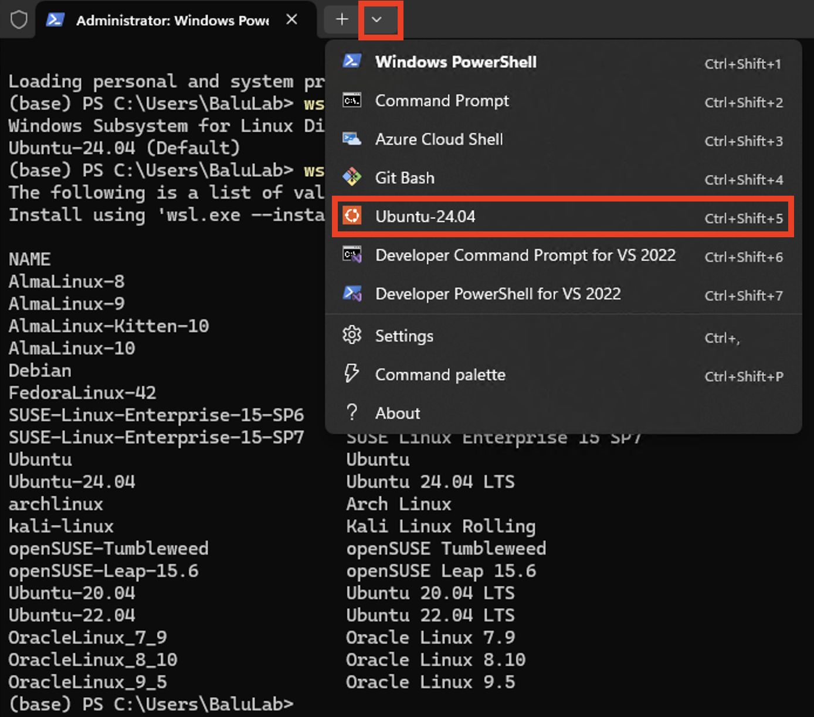
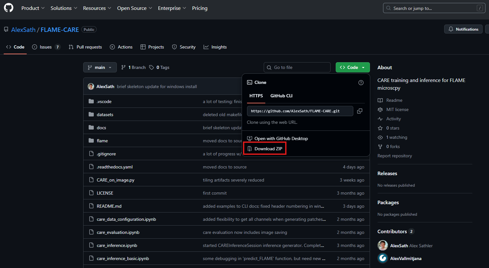
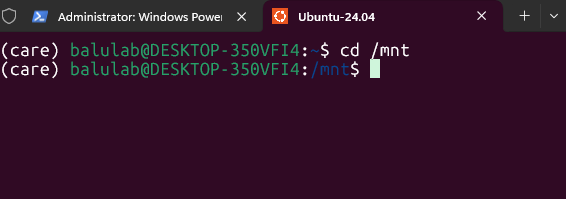
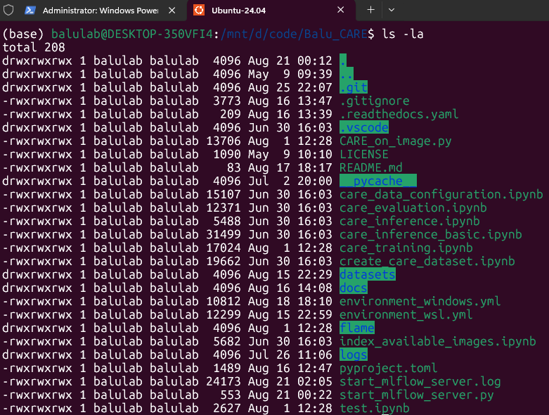
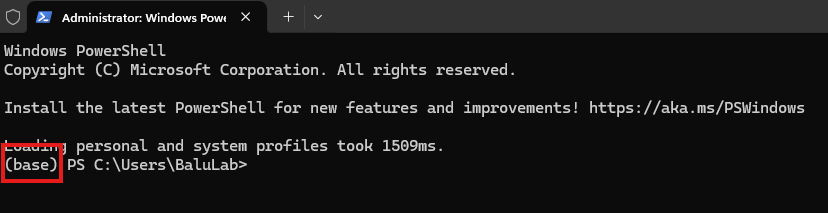
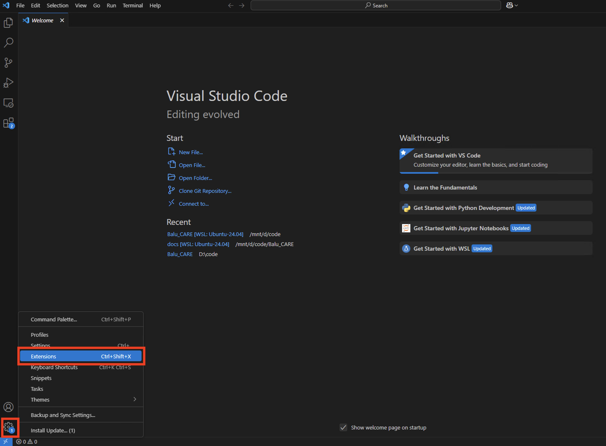
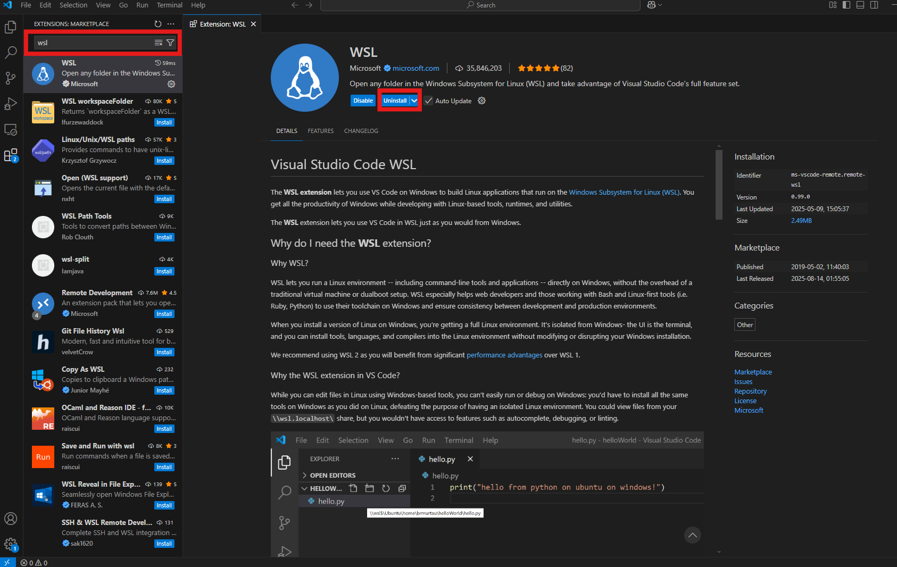
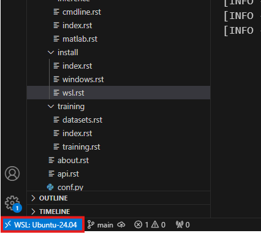

==============================
WSL (Training & CLI Inference)
==============================

WSL stands for Windows Subsystem for Linux. It is required for training because training is performed through
the TensorFlow package. TensorFlow can only interface with the GPU on a Windows computer using the WSL virtual machine 
as an interface (as of Aug 2025). Thus, Python packages and dependencies must be installed on WSL for training.

The WSL interface can also be used for inference. However, to run inference, **CUDA, cuDNN, and TensorRT will have to be
installed in WSL separately from any native Windows installations**. While inference is possible thorugh WSL, this tutorial 
is designed for training; therefore, it won't include installation instructions for these dependencies in WSL for now.

1. Install WSL (Ubuntu 24.04)
^^^^^^^^^^^^^^

a. Open PowerShell
~~~~~~~~~~

Hit the Windows Button or visit the Start Menu and type "PowerShell".

b. Install
~~~~~~~~~~

List possible WSL distributions and verify that ``Ubuntu-24.04`` is present:

::
    wsl --list --online

Next, install the desired distribution:

::
    wsl --install Ubuntu-24.04

c. Open WSL
~~~~~~~

Close and re-open the PowerShell prompt. Then, open WSL according to the image below:

2. Downloading Source Code
^^^^^^^^^^^^^^

a. Visit GitHub
~~~~~~~~~~~

Either using GitHub CLI or the GitHub ZIP downloader, download the source code from 
`the FLAME-CARE repository <https://github.com/AlexSath/FLAME-CARE>`_.

⚠️ It is recommended that the source code be installed to the Windows filesystem (File Explorer on Windows machine) as
opposed to the WSL filesystem. This way both Windows and WSL will have easy access to the code.

Below is an image of how to download the ZIP:

If issues are still experienced when downloading the source code, visit the `Windows Install Page 
<https://flame-care.readthedocs.io/en/latest/install/windows.html>`_ for more information.

b. Access Windows Filesystem through ``mnt``
~~~~~~~~~~

If following the instructions, the source code should be installed on the Windows Filesystem. To access it in WSL,
simply use the "Mount" path found at ``/mnt``. Example:

``cd`` (Change Directory) and ``ls`` (List Files) can then be used to navigate to the folder where the source
code was installed. Once the source directory is reached, files matching the GitHub repository should be seen:

3. Create CARE Conda environment
^^^^^^^^^^^^^^

a. Download miniconda
~~~~~~~~~~~

Visit your home directory:

::
    cd ~

Then, download the installer script:

::
    wget https://repo.anaconda.com/miniconda/Miniconda3-latest-Linux-x86_64.sh

Finally, run the script:

::
    bash ~/Miniconda3-latest-Linux-x86_64.sh

Finally, restart your shell.

⚠️ Conda will ask you a variety of questions during the installation. Defualts are fine, but **be sure to selected "yes"
when prompted whether miniconda should alter your shell configuration**. This will make initialization easier in
subsequent steps.

You should see ``(base)`` in your shell after restarting:

b. Populate the CARE enviornment
~~~~~~~~~~~~

Visit the folder where the ``FLAME-CARE`` files can be found. Revisit Step 2b for more information.

Within that folder, install the conda environment (this will take 10-15 minutes):

::
    conda env create -f ./environment_wsl.yml

Once finished, activate the conda environment:

::
    conda activate care

Resulting in the ``(care)`` prefix in your shell.

4. VSCode (For Jupyter-based Training)
^^^^^^^^^^^

a. Download VSCode
~~~~~~~~~~

On your Windows web browser, download VSCode from the `website <https://code.visualstudio.com/download>`_.

Once installed, open the application.

b. Add the WSL extention
~~~~~~~~~~~

In the VSCode settings, hit extensions:

Once on the extensions screen, type ``wsl`` in the search bar and click on the WSL extension. Hit the blue ``install``
button and wait until it switches to ``uninstall`` (indicating a successful install):

Repeat for the following extensions:
* Python
* Jupyter

c. Open VSCode in WSL
~~~~~~

Finally, in your WSL shell, re-navigate to the directory with FLAME-CARE code (see step 2b).

Then, open VSCode through the CLI:

::
    code .

This should open a new Window of VSCode that is connected to WSL:

