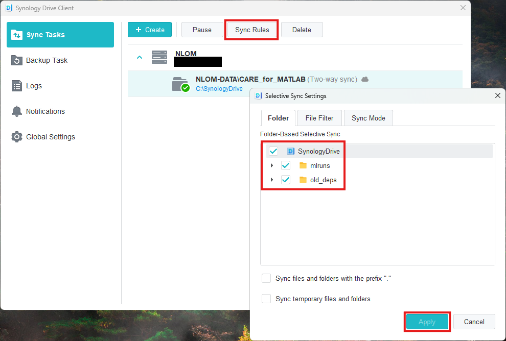

===============
Version Control
===============

Introduction
^^^^^^^^^^^^

Version Control is a key component of Machine Learning Operations (MLOps). It allows for understanding of where
models come from as experimental parameters are iterated through. It enables easy access to the best models
based on well-documented evaluation techniques.

To enable version control, this project utilizes two tools. 

I. MLFlow
~~~~~~~~~

`MLFlow <https://mlflow.org/docs/2.2.2/>`_ is a platform for managing machine learning lifecycles. As projects grow 
along with datasets, scientists can often grow overwhelmed by the number of parameters that need to be tracked to 
understand the training, inference, and performance of any given model in their project. **The purpose of MLFlow 
in CARE for FLAME is to provide infrastructure to track these parameters and simplify decision-making in choosing a 
model for FLAME image denoising in the clinic**.

MLFlow will be installed as a part of the ``care`` Conda environment built in either of the install tutorials.

Once MLFlow is installed, it can interface with any model repository. MLFlow model storage is split into **metadata**
and **artifact** storage. While both can and will be stored in Synology Drive in this project, each has their own 
range of possibilities. See `backend <https://www.mlflow.org/docs/latest/ml/tracking/backend-stores>`_ and 
`artifact <https://mlflow.org/docs/latest/ml/tracking/artifact-stores>`_ stores for more information.

II. Synology Drive
~~~~~~~~~~~~~~~~~

To enable file sharing, this project was built and tested using Synology Drive. While MLFlow can detect and use models
in any location on the local machine's filesystem, Synology Drive enables someone on one computer to train a model which
then gets automatically synced with another machine that has the same Synology Drive folder mounted on their filesystem.
Therefore, Synology Drive enables synced model training and sharing for all members of Balu Lab.

1. Synology Drive Mount
^^^^^^^^^^^^^^^^^^^^^^^

To mount Synology Drive, download the `Synology Drive Client <https://www.synology.com/en-global/support/download/RS1221RP+?version=7.2#utilities>`_

Once downloaded, create a Sync Task.

Add the Synology Drive server using the IP provided by other members of Balu Lab.

Hit ``Create`` and ensure that the ``NLOM-DATA/CARE_for_MATLAB/mlruns`` folder is mounted to your machine:
* If ``NLOM-DATA`` is mounted, then all directories within ``NLOM-DATA`` will appear in a new ``SynologyDrive`` folder 
  on the machine.
* If ``NLOM-DATA/CARE_for_MATLAB`` is mounted, then all directories within ``CARE_for_MATLAB`` will appear in the 
  ``SynologyDrive`` folder.

Assuming that ``NLOM-DATA/CARE_for_MATLAB`` was mounted, and the following was selected in ``Sync Rules``:

Then the user would see the following in their file tree:

2. MLFlow
^^^^^^^^^

To download MLFlow, follow the instructions for setting up the ``care`` conda environment in the :doc:`/training` for details.

a. Starting Tracking Server
~~~~~~~~~~~~~~~~~~~~~~~~~~~

In your command-line interface, navigate to the folder where the ``flame-care`` repository is installed and the ``flame``
module is accessible.

With the ``care`` conda environment active, run the following command:

::
    python start_mlflow_server.py --ip 127.0.0.1 --port 5050 --tracking-direc </path/to/CARE_for_MATLAB/mlruns>

⚠️ DO NOT USE ``mlflow server`` COMMAND-LINE API TO START MLFLOW TRACKING SERVERS
-----------

Using the ``mlflow server`` command-line API for Balu-Lab CARE purposes **risks permanent deletion** of all models in 
the Synology Drive mlruns folder. This is because using the ``mlflow server`` API with local directories was not designed 
for servers that can be mounted on multiple machines at different locations like Synology Drive. 

Please use ``start_mlflow_server.py`` as indicated above instead, which has a few built-in workarounds to prevent
this issue.

⚠️ Server processes must be deleted
-------------

``start_mlflow_server.py`` lacks the capability of determining the Python subprocess that hosts the MLFlow server. Without
killing the process in-between the creation of servers, the user could find themselves with many MLFlow servers being
hosted at once.

To prevent this, the server processes must be killed manually.

* On Windows, open Task Manager and scroll past "Background Processes". Find Python processes and hit "End Task"

* On WSL / Linux, type:

::
    ps -a

Find the PID of the first python process after the mlflow process:

Then, kill the process:

::
    kill <PID>

b. Viewing Stored Models
~~~~~~~~~~~~~~~~~~~~~~~~

Once the tracking server has been started, it can be accessed through a web browser. Use the following as the web address:

::
    127.0.0.1:5050

The MLFlow server GUI will appear:

c. Model Registry
~~~~~~~~~~~~~~~~~

The Model Registry is the **database within MLFlow that tracks models that are ready for deployment**. For a model to be
used for inference by ``CARE_on_image.py``, it must exist within the model registry.

Types of stored models:
-------------

* MLFlow **runs** are each model in their most raw format. These can be found in the GUI ``Experiments`` tab. Here, model
  metaparameters are stored along with their artifacts. Artifacts are not stored here by default, but the server is set
  up using ``start_mlflow_server.py``, they will appear under the ``Artifacts`` tab once a run is clicked on.
  `Read more <https://mlflow.org/docs/latest/api_reference/python_api/mlflow.html#mlflow.start_run>`_.
* MLFlow **registered models** are formalized models that are ready for deployment. Registered models are not duplicates
  of model runs. Instead, registered models contain a dictionary mapping specific versions of the deployable model to
  specific MLFlow Run IDs where the model can be found. `Read more <https://mlflow.org/docs/latest/ml/model-registry/>`_.

Registering a model of interest:
------------

To register a model of interest, first click on it within the ``Experiments`` tab. An experiment run page looks like this:

Then, click the ``Register`` button, select the desired model registry from the dropdown, and hit ``Register`` in the popup.

The MLFlow run will now be mapped under a version of the selected model registry in the ``Models`` tab!

