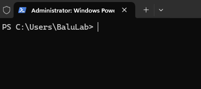
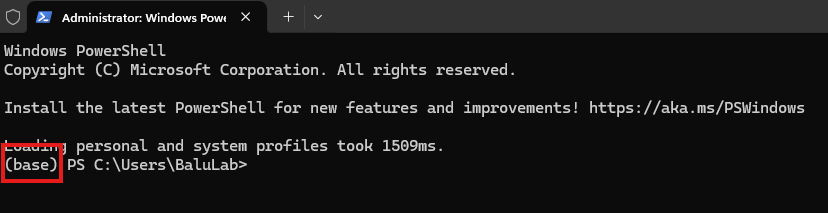

### Install on Windows (Command-Line Inference & MATLAB Inference ONLY)

#### 1. Install MATLAB
Visit MATLAB downloads on downloads site. [Link](https://www.mathworks.com/downloads/)

Download & Install R2024b on your Windows machine.

#### 2. Install Conda
Visit the [Anaconda website](https://www.anaconda.com/download/success) and download the latest Windows Miniconda installer. [Direct Link](https://repo.anaconda.com/miniconda/Miniconda3-latest-Windows-x86_64.exe).

Once installed using the downloaded `.exe`, open a Powershell instance of command-prompt. It should look something like this:



Type the following command:
```
conda init
```

After hitting enter and allowing the command to run its course, close and re-open the command-prompt. You should now see `(base)` at the beginning of your prompt:



#### 3. Create CARE Environment
With a conda-initialized shell, navigate to the directory where this repository is installed using `cd` commands. [Detailed Tutorial](https://www.lifewire.com/change-directories-in-command-prompt-5185508).

Once navigated to the repository directory, create an environment for your Python CARE:

```
conda env create -f environment_windows.yml
```

This will install the following dependencies in the CARE environment:
 - **CUDA Version (Python): 12.5**
 - **cuDNN Version (Python): 9.3.0**

##### Handling common problems during CARE environment initialization:
1. Pip package cannot be installed.

**SOLUTION:** In `environment_windows.yml`, change the package version of the package that cannot be installed.

```
 - <package_name>==x.x.x
```

could become:

```
 - <package_name>==y.y.y
```

2. `matlabengine` package cannot be installed.

**SOLUTION:** Verify That the correct version of MATLAB (R2024b) is installed.

#### 4. Installing TensorRT 10.11.0
1. Dowload ZIP file: [Download Link](https://developer.nvidia.com/downloads/compute/machine-learning/tensorrt/10.11.0/zip/TensorRT-10.11.0.33.Windows.win10.cuda-12.9.zip)
2. Unpack ZIP
3. Copy `TensorRT-10.11.0.33` to `C:\Program Files`
4. Add `TensorRT-10.11.0.33\lib` to system PATH
4. Add `TensorRT-10.11.0.33\bin` to system PATH